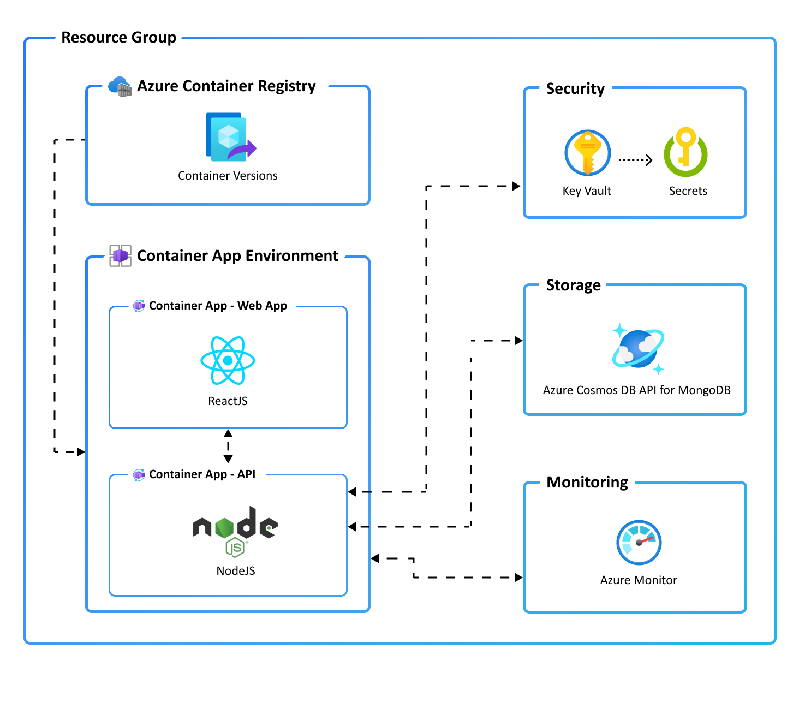

# Azure Dev CLI

The Azure Developer CLI (azd) is a developer-centric command-line tool for cloud applications designed to:

* reduce the time required for a developer to be productive
* demonstrate opinionated best practices for Azure development
* help developers understand core Azure development constructs
* You can use the same developer workflow for any Azure Developer CLI enabled templates.

You can also access preview Azure Developer CLI functionality from within Visual Studio Code. You can try out our [Visual Studio Code extension](https://marketplace.visualstudio.com/items?itemName=ms-azuretools.azure-dev) by installing it from the Visual Studio Code Marketplace. From the VS Code extension, you can use all the Azure Developer CLI commands.

## Workflow

The azd focuses on the developer workflow. Apart from provisioning/managing Azure resources, the CLI helps stitch cloud components, local development configuration and pipeline automation into a complete solution.

A typical developer workflow looks like this:

* **init**: Create an application and initialize an environment using a sample template in your preferred language.
* **provision**: Provision the necessary resources for your application on Azure.
* **deploy**: Deploy your application to Azure.
* **monitor**: Monitor your application’s behavior and performance and validate deployments.
* **pipeline config**: Create and manage CI/CD (continuous integration and continuous delivery).

## Pre-requisites

In this workshop, you create infrastructure and deploy code to Azure. If you don't have an Azure Subscription, sign up for [a free account](https://azure.microsoft.com/free/).

Before you get started, ensure you have the following tools installed on your local machine:

* [Git](https://git-scm.com/)
* [GitHub CLI v2.13+](https://github.com/cli/cli)
* [Azure CLI (v 2.38.0+)](/cli/azure/install-azure-cli)
* Azure Developer CLI (azd)

### Windows

```powershell
powershell -ex AllSigned -c "Invoke-RestMethod 'https://aka.ms/install-azd.ps1' | Invoke-Expression"
```

### Linux/macOS

```bash
curl -fsSL https://aka.ms/install-azd.sh | bash 
```

## Workshop

We'll use the ToDo Application with a Node.js API and Azure Cosmos DB API for MongoDB, and Container Apps for this tutorial. Upon completion, you'll get the code in your development environment and will be able to run commands to build, deploy, and monitor the app in Azure.

The repository contains the instructions and source code to build a complete sample ToDo application with a web frontend built in React.js and the backend API built using Typescript Express REST API. Both frontend and backend applications are deployed to Azure Container Apps.

* [Workshop Exercise Template](https://github.com/Azure-Samples/todo-nodejs-mongo-aca)
(While you're provisioning resources - it's a great opportunity to feedback your experiences with the Azure Developer CLI [here](https://microsoft.qualtrics.com/jfe/form/SV_eCHU9Hs0OHDxcii?channel=nodeone)



### Running Playwright tests

Complete the included /tests/README.md instructions containing an included [Playwright](https://playwright.dev/) smoke test that will hit the ToDo app web endpoint, create  and delete an item.

## References

* [We need your feedback](https://microsoft.qualtrics.com/jfe/form/SV_eCHU9Hs0OHDxcii?channel=nodeone)
* [Azure Developer CLI Docs](https://docs.microsoft.com/azure/developer/azure-developer-cli/)
* [Templates](https://aka.ms/azure-dev/templates)
* [Getting started with the VS code Extension](https://docs.microsoft.com/azure/developer/azure-developer-cli/debug?pivots=ide-vs-code&tabs=linuxmac)
